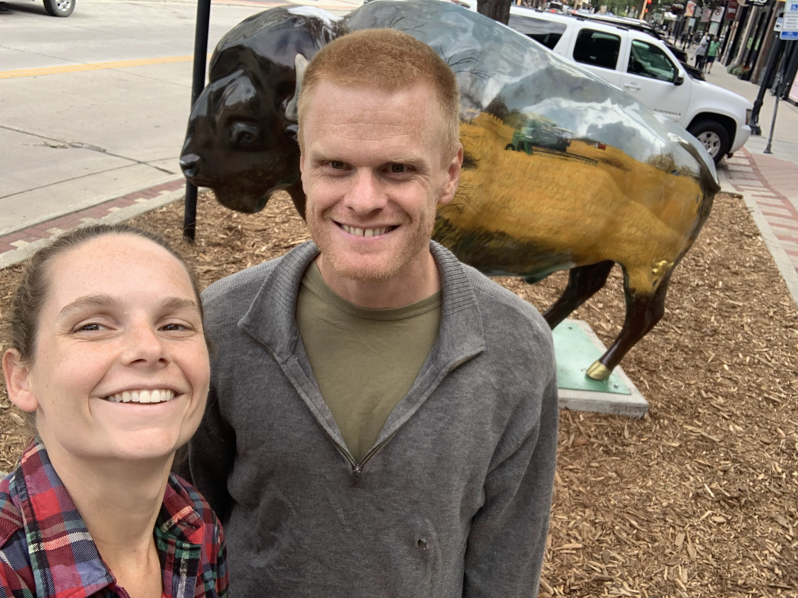

# Frequently Asked Questions

## What Should I Wear?
Essentially, whatever you want! A couple of things to help guide your choices:
- The ceremony and reception will both take place outdoors on grass, so we recommend comfortable shoes that won't sink into the earth.
- The bride and groom are going for "cookout," "earthy," "farm-in-Vermont" vibes.

## Is Everything Happening Outdoors?
The groom is a weather person and has promised a dry, mild day. That being said, if his connections don't pull through, it might get hot and it might rain. We will have a tent on site for sun and rain protection.

## Should I Bring My Children?
To give all of our guests the opportunity to celebrate without having to worry about little eyes and ears, we respectfully request no children under the age of 14.

## I'm looking at the pictures on this page—is the wedding buffalo themed?
No.

