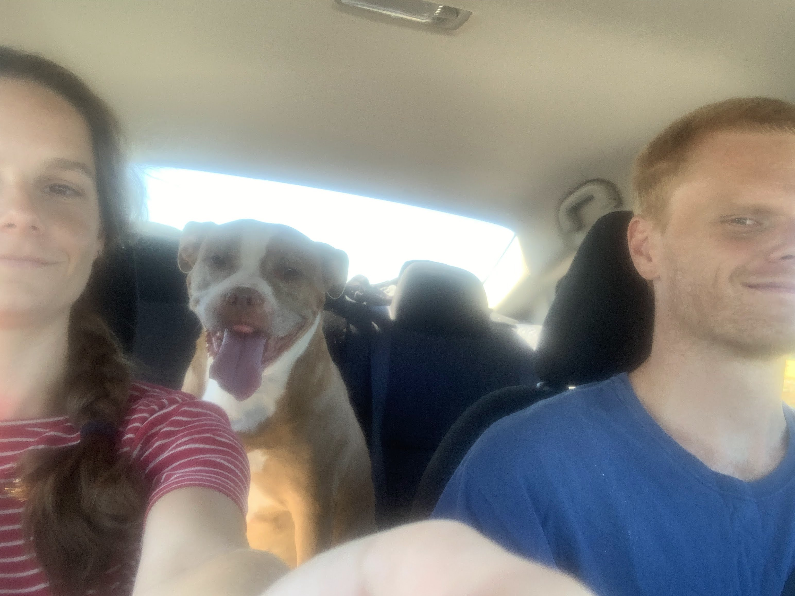

# How to Get Here | Where to Stay
## The Fielder Farm | 150 Fielder Farm Rd. | Huntington, VT 05462

## Transport

### Train

There is an Amtrack station in Waterbury (WAB). The train station is
about a 40 minute drive from Fielder Farm.  If you are coming in by
train, please let us know in your RSVP and we will arrange a carpool /
pickup.

### Plane

If you are flying, we recommend the Burlington (BTV) airport. The
airport is about a 40 minute drive from Fielder Farm.

### Automobile

If you plan to have a car while you're in town, and you would be
willing to help carpool other guests, please let us know!

## Lodging
### Airbnb/VRBO
We recommend staying in an AirBnb or VRBO in the area—they are very cute and tend to be less expensive than hotel rooms. [Check some out here!](https://www.vrbo.com/search/keywords:huntington-vermont-united-states-of-america/arrival:2023-08-11/departure:2023-08-13?adultsCount=2&petIncluded=false&filterByTotalPrice=true)

### Hotel

If you are coming in to Burlington, some guests are staying at:
[Fairfield Inn Burlington
Williston](https://www.marriott.com/en-us/hotels/btvfb-fairfield-inn-burlington-williston/overview/)

If you are coming in to Waterbury, another option is:
[Best Western Plus Waterbury -
Stowe](https://www.bestwesternwaterburystowe.com/)

There are also many other hotels in the area.

### Camping
There are several campsites in the area, and we are inquiring into whether camping is allowed on the Fielder Farm Grounds—check back here later.
